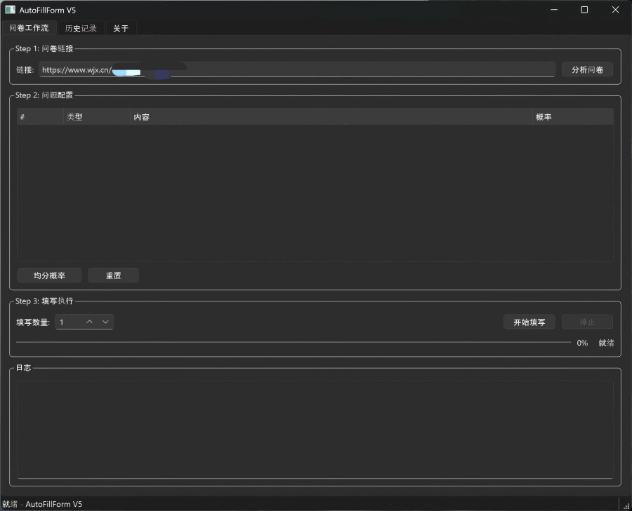

# AutoFillForm V5


## 项目简介

**AutoFillForm V5** 是一个基于 PySide6 和 Playwright 的智能问卷自动填写工具。通过 YAML 配置文件，您可以灵活地定义问卷填写规则，支持多种题型（单选、多选、矩阵、填空、下拉框），并可根据概率权重智能选择答案。

### 界面预览



### 技术特色

- **现代化架构**: 从 V4 升级，迁移至 PySide6 + Playwright 技术栈
- **MVC 设计模式**: 清晰的代码结构，易于维护和扩展
- **YAML 配置**: 灵活的规则配置，支持概率权重
- **多平台支持**: 支持问卷星、腾讯问卷、见数问卷、Qualtrics 等主流问卷平台
- **会话管理**: 支持历史记录保存和会话恢复

## 主要功能

### 1. 问卷分析
- 自动解析问卷页面结构
- 提取题目类型、选项数量等信息
- 生成可编辑的 YAML 配置模板

### 2. 规则配置
- YAML 格式配置文件，易于编写和维护
- 支持概率权重配置，实现智能随机填写
- 可为每个选项设置不同的选中概率

### 3. 自动填写
- **单选题 (radio_selection)**: 按权重随机选择
- **多选题 (multiple_selection)**: 每个选项独立概率
- **矩阵题 (matrix_radio_selection)**: 子问题独立配置
- **填空题 (blank_filling)**: 预设文本库随机选择
- **下拉题 (dropdown_selection)**: 按权重选择选项

### 4. 智能验证
- 验证码自动识别与处理
- GUI 自动化辅助操作

### 5. 会话管理
- 历史记录保存
- 会话状态恢复
- 日志记录与导出

## 技术架构

### 技术栈

| 组件 | 版本 | 用途 |
|------|------|------|
| PySide6 | 6.6.1 | 图形界面框架 |
| Playwright | 1.40.0 | 浏览器自动化 |
| BeautifulSoup4 | 4.12.2 | HTML 解析 |
| PyYAML | 6.0.1 | 配置文件解析 |
| qasync | 0.27.1 | 异步集成 |
| pyautogui | Latest | GUI 自动化 |
| pywin32 | 306 | Windows API |

### MVC 架构

```
AutoFillForm V5
├── Models (数据层)
│   ├── SurveyModel      # 问卷数据管理
│   ├── RuleModel        # 规则文件管理
│   └── HistoryModel     # 历史记录管理
├── Views (视图层)
│   ├── MainView         # 主窗口视图
│   ├── WorkflowView     # 工作流视图
│   └── HistoryView      # 历史记录视图
└── Controllers (控制层)
    ├── MainController   # 主控制器
    ├── WorkflowController # 工作流控制
    └── HistoryController # 历史记录控制
```

## 安装说明

### 环境要求

- Python 3.7 或更高版本
- Windows 操作系统（推荐）

### 安装步骤

```bash
# 1. 克隆或下载项目
git clone <repository_url>
cd AutoFillForm

# 2. 安装 Python 依赖
pip install -r Codes/requirements.txt

# 3. 安装 Playwright 浏览器
playwright install chromium

# 4. 运行应用
cd Codes
python app.py
```

## 使用方法

### 快速开始

1. **启动应用**
   ```bash
   cd Codes
   python app.py
   ```

2. **分析问卷**
   - 在界面中输入问卷链接
   - 点击"分析"按钮，自动解析问卷结构
   - 系统将生成 YAML 配置模板

3. **配置规则**
   - 编辑生成的 YAML 文件
   - 为每个题型设置概率权重
   - 保存配置文件

4. **执行填写**
   - 选择配置好的规则文件
   - 设置填写份数
   - 点击"开始填写"

### 详细操作流程

#### 第一步：分析问卷
```
输入问卷链接 → 点击分析 → 查看解析结果 → 导出配置模板
```

#### 第二步：编辑配置
```yaml
url: https://www.wjx.cn/vm/XXXXXXXX
number_of_questionnaires_to_be_filled_out: 10
rules:
  - radio_selection: [50, 50]        # 单选题，两选项各50%概率
  - multiple_selection: [50, 50, 50] # 多选题，每个选项50%选中概率
  - matrix_radio_selection:          # 矩阵题，每行独立配置
      - [50, 50, 0, 0]
      - [50, 50, 0, 0]
  - blank_filling:                   # 填空题，预设文本和概率
      - ["答案1", "答案2"]
      - [50, 50]
  - dropdown_selection: [30, 70]     # 下拉题，两选项30%/70%概率
```

#### 第三步：执行任务
```
选择规则文件 → 设置填写份数 → 开始填写 → 查看日志 → 保存结果
```

## 项目结构

```
AutoFillForm/
├── Codes/                    # 主应用程序源码
│   ├── app.py                 # 应用程序入口
│   ├── controllers/           # MVC 控制器
│   │   ├── __init__.py
│   │   ├── main_controller.py
│   │   ├── workflow_controller.py
│   │   └── history_controller.py
│   ├── views/                 # PySide6 视图
│   │   ├── __init__.py
│   │   ├── main_view.py
│   │   ├── workflow_view.py
│   │   └── history_view.py
│   ├── models/                # 数据模型
│   │   ├── __init__.py
│   │   ├── survey_model.py
│   │   ├── rule_model.py
│   │   └── history_model.py
│   ├── automation/            # 核心自动化逻辑
│   │   ├── browser_setup.py   # 浏览器设置
│   │   ├── form_filler.py     # 表单填写
│   │   └── verification.py    # 验证码处理
│   ├── utils/                 # 工具类
│   │   ├── logger.py          # 日志工具
│   │   └── yaml_validator.py  # YAML 验证
│   ├── tools/                 # 辅助工具
│   │   ├── read_list_data_from_file.py
│   │   └── url_change_judge.py
│   └── requirements.txt       # 依赖清单
├── Docs/                      # 文档
│   └── README.md              # 原始需求文档
├── rules/                     # YAML 规则文件目录（自动创建）
├── history/                   # 历史记录目录（自动创建）
└── README.md                  # 本文件
```

## YAML 配置说明

### 配置文件结构

```yaml
# 问卷链接
url: https://www.wjx.cn/vm/XXXXXXXX

# 填写份数
number_of_questionnaires_to_be_filled_out: 10

# 填写规则列表（按题目顺序）
rules:
  # 单选题配置
  - radio_selection: [50, 50, 50]  # 三个选项，权重分别为50/50/50

  # 多选题配置
  - multiple_selection: [50, 50, 50, 50]  # 每个选项50%选中概率

  # 矩阵单选题配置
  - matrix_radio_selection:
      - [50, 50, 0, 0]  # 第一行：前两个选项各50%概率
      - [50, 50, 0, 0]  # 第二行：同上

  # 填空题配置
  - blank_filling:
      - ["文本1", "文本2", "文本3"]  # 预设文本列表
      - [50, 50, 50]                # 对应概率权重

  # 下拉题配置
  - dropdown_selection: [30, 70]  # 两个选项，30%和70%概率
```

### 各题型配置语法

| 题型 | 键名 | 格式 | 说明 |
|------|------|------|------|
| 单选题 | `radio_selection` | `[权重1, 权重2, ...]` | 按权重随机选择一项 |
| 多选题 | `multiple_selection` | `[概率1, 概率2, ...]` | 每项独立判断是否选中(0-100) |
| 矩阵题 | `matrix_radio_selection` | `[[行1权重], [行2权重], ...]` | 每行独立配置 |
| 填空题 | `blank_filling` | `[[文本列表], [权重列表]]` | 从预设文本中选择 |
| 下拉题 | `dropdown_selection` | `[权重1, 权重2, ...]` | 按权重选择选项 |

## 常见问题

### 安装问题

**Q: pip install 安装依赖时报错？**

A: 请确保使用 Python 3.7 或更高版本，并尝试升级 pip：
```bash
python -m pip install --upgrade pip
pip install -r Codes/requirements.txt
```

**Q: playwright install chromium 失败？**

A: 可能是网络问题，可以尝试配置镜像源：
```bash
set PLAYWRIGHT_DOWNLOAD_HOST=https://npmmirror.com/mirrors/playwright/
playwright install chromium
```

### 使用问题

**Q: 分析问卷时无法获取题目？**

A: 请检查：
1. 问卷链接是否正确
2. 网络连接是否正常
3. 问卷是否需要登录才能访问

**Q: 填写时出现元素定位失败？**

A: 可能原因：
1. 问卷页面结构发生变化，需要重新分析
2. 网络延迟导致页面未完全加载，可增加延迟时间

**Q: 验证码无法自动处理？**

A: 目前部分验证码需要手动处理，程序会在需要时暂停等待用户操作。

## 版本历史

### V5.0.3 (2026-02-24)

**主要更新：**
- [样式] 居中对齐历史和工作流视图的树形组件标题
- [修复] 正确管理 Playwright 实例生命周期，防止资源泄漏

### V5.0.2 (2026-02-23)

**主要更新：**
- [重构] 将 GUI 框架从 PyQt6 迁移至 PySide6，解决 macOS Nuitka 构建问题
- [修复] macOS CI 构建 Nuitka 不支持 PyQt6 的 FATAL 错误
- [修复] CI 构建使用 --mode=app 解决 macOS Foundation 错误
- [修复] Linux/macOS Playwright node 二进制文件冲突

### V5.0.1 (2026-02-23)

**主要更新：**
- [新增] 关于页面 GitHub Release 更新检查与下载功能
- [新增] 跨平台支持 (Windows / macOS / Linux)
- [新增] 跨平台 DPI 缩放检测 (`screen_resolution.py`)
- [新增] macOS / Linux 浏览器自动检测
- [优化] CI/CD 构建支持三平台矩阵 (Windows / macOS / Linux)
- [优化] Release Notes 由 git-cliff 自动生成
- [修复] cliff.toml 中 remote_url 指向错误仓库

### V5.0.0 (2025-02-23)

**主要更新：**
- [新增] 完全迁移至 PySide6 框架，提升 UI 性能
- [新增] 使用 Playwright 替代 Selenium，提高稳定性
- [新增] MVC 架构重构，代码更清晰
- [新增] 会话恢复功能，支持中断后继续
- [新增] 集中化版本管理，支持语义化版本号
- [优化] 工作流视图，操作更直观
- [优化] 历史记录管理，数据更安全
- [优化] 发布流程自动化，单一版本源

### V4 (已停止维护)

- Tkinter + Selenium 架构

## 许可证

本项目采用 MIT 许可证。详见 [LICENSE](LICENSE) 文件。

## 贡献

欢迎提交 Issue 和 Pull Request！

## 联系方式

如有问题或建议，请通过以下方式联系：
- 提交 Issue
- 发送邮件

---

**注意**: 本工具仅供学习和研究使用，请遵守相关问卷平台的使用条款。
